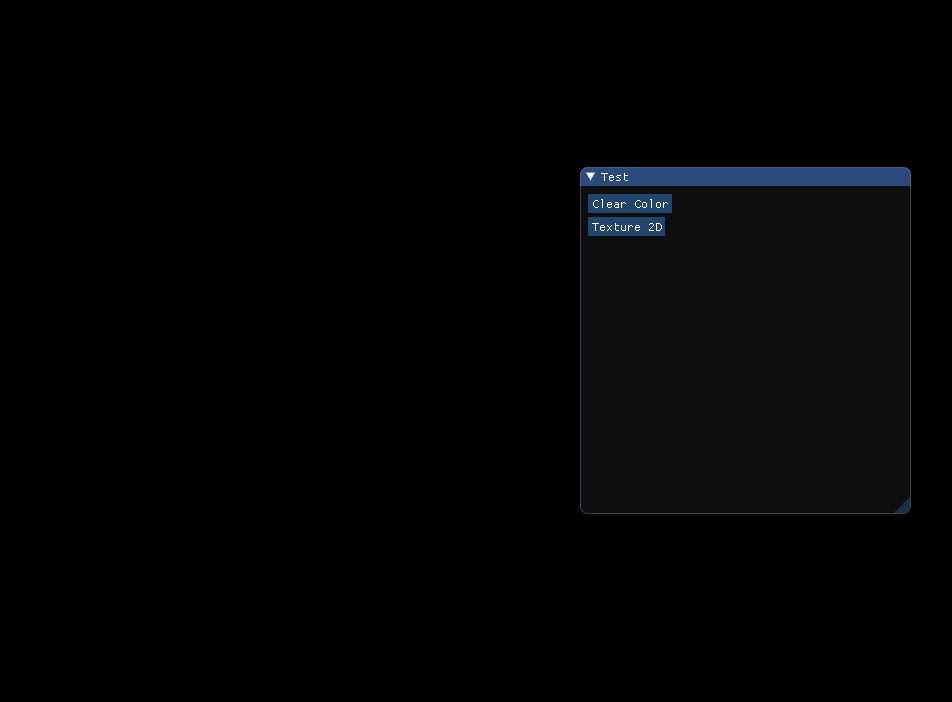
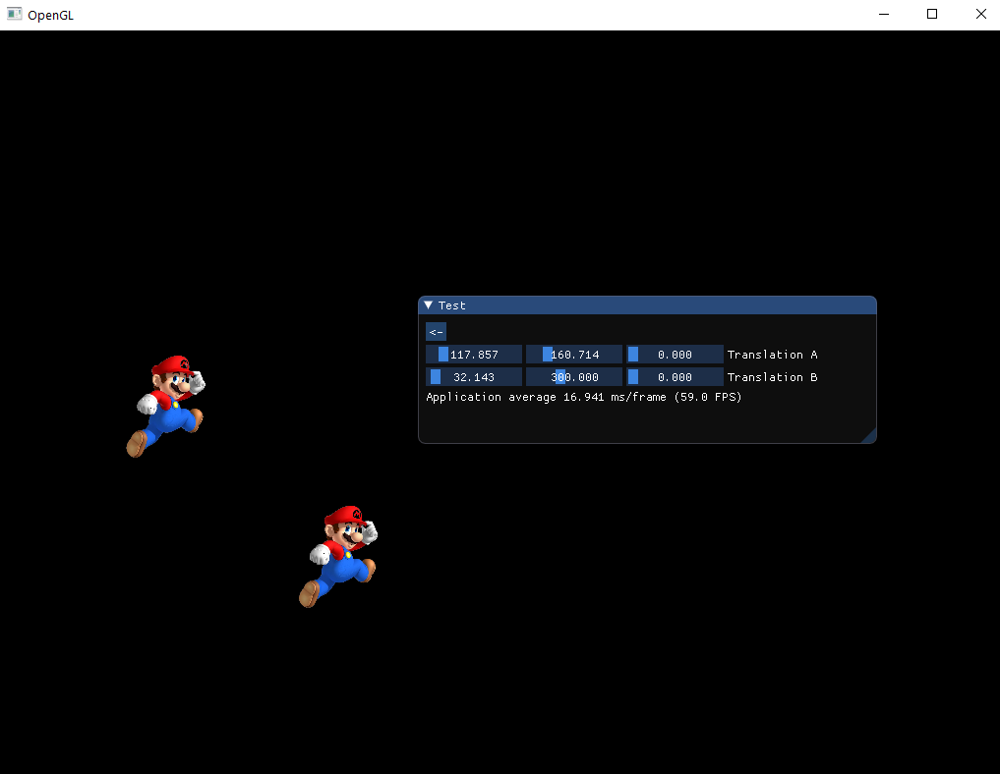

# Sandbox-openGL
OpenGL Test Sandbox, Purpose of creating this sandbox type application is to facilitate the easy and fast accessibility of OpenGL stuff

The way this sandbox application works is that, it's has a Test Menu type window which consists of different type of OpenGL stuff such as Texture2D, Texture 3D, Frame Buffers, Shadows, Lightining etc. you can click on these menu item to view a sample of these things. And if you want to learn how these things are rendered on screen you can just directly open the source file for that specific test and can look what's going in the backend.

You can learn and implement these things in your own Graphics applications such as games and all.

This sandbox application is written from scratch using glfw, glm, ImGui. Thus, it's a good point to start your graphics journey.
 

### Status
Will be adding more stuff soon, Currently in Progress
- 3D Textures
- FrameBuffers
- Shadows
- Lighting
- Multiple 3D Textures
- Batch Rendering
- Camera
and Much More.

### Preview
 

